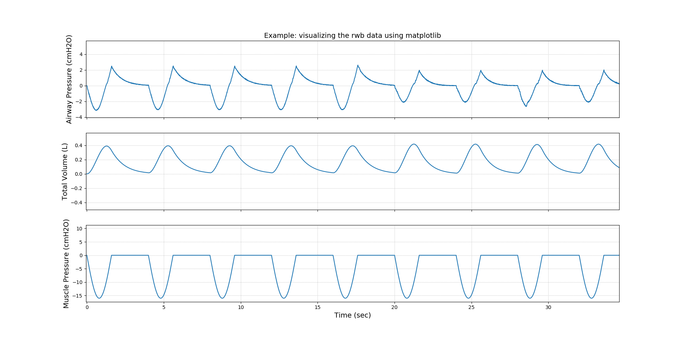

[](https://badge.fury.io/py/asl5000-utils)

# asl-utils

A bunch of functions to extract data from the ASL 5000.

## What's the ASL?

The __ASL 5000&trade;__ is a breathing simulator capable of simulating a wide range of patients, produced by __IngMar Medical&copy;__.
It is mainly used for educational purpose, developing products and testing ventilators. Check the IngMar Medical [website](https://www.ingmarmed.com/product/asl-5000-breathing-simulator/) for more information.

# Install

The ASL5000 utils can be installed using the pip package manager:
```cmd
pip install asl5000-utils
```

# Usage

Let's our environment be:
```
./
    data/
        simulation.rwb
        simulation.avb
        simulation.brb
    main.py
```

`main.py`
```python
import asl5000_utils as asl
import matplotlib.pyplot as plt

labels, array = asl.read_rwb("./data/simulation.rwb")
print(labels)
# ['Time (sec)', 'Airway Pressure (cmH2O)', 'Muscle Pressure (cmH2O)', 'Tracheal Pressure (cmH2O)', 'Chamber 1 Volume (L)', 'Chamber 2 Volume (L)', 'Total Volume (L)', 'Chamber 1 Pressure (cmH2O)', 'Chamber 2 Pressure (cmH2O)', 'Breath File Number (#)', 'Aux 1 (V)', 'Aux 2 (V)', 'Oxygen Sensor (V)']
time = array[0]
time_label = labels[0]
curves = [1, 6, 2]  # Paw, Volume, Pmus

fig, ax = plt.subplots(len(curves), 1, sharex=True)
plt.title("Example: visualizing the rwb data using matplotlib")
for i, index in enumerate(curves):
    ax[i].plot(time, array[index])
    ax[i].set_ylabel(labels[index])
ax[-1].set_xlabel(time_label)

for a in ax:
    a.grid(linestyle="dotted")
plt.show()
```



In the same way, you can use `asl.read_avb` or `asl.read_brb` to read `data/simulation.avb` or `data/simulation.brb`.
